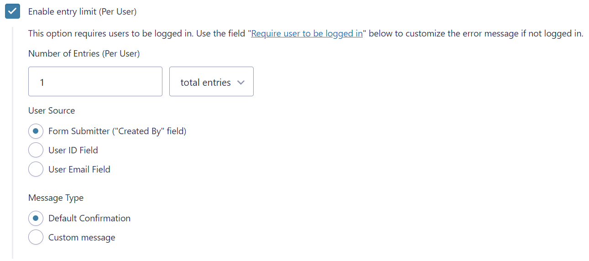

# RS Gravity Forms Limited Entries

This plugin allows you to limit any Gravity Form to a single entry per user, or a set number of entries per user.

Find the setting under **Form Settings > Restrictions** after to the default "Enable entry limit" field (which does not limit by user).

**New fields available:**



## Required Plugins

* Gravity Forms

## How to use

1. Install and activate the plugin
2. Navigate to the form of your choice and go to the Form Settings
3. Scroll down to the "Restrictions" section under Form Settings
4. Check the box "Enable entry limit (Per User)"

## Additional settings (once enabled)

* **Number of Entries (Per User)** - The maximum number of entries a user can submit, and the time frame to look within (All time, per day, per week, per month, or per year)
* **User Source** - How to compare the current user. Options include: form submitter (default), a user ID field, or an email field.
* **Message Type** - Choose to display the default confirmation message or a custom message which you can specify.

## Developer Hooks

**Filter the user's email:** This filter can change the email address used to compare a user by email. You may need this if users support more than one email field.

```
$email = apply_filters( 'rs_gf_limited_entries/get_user_email', $email, $user_id );
```

**Filter the displayed message:** This filter can change the message displayed when a user has reached their limit.

```
$message = apply_filters( 'rs_gf_limited_entries/get_limit_message', $message, $form, $settings );
```

## Changelog

### 1.0.1

* Changed to only check active entries

### 1.0.0

* Initial release
